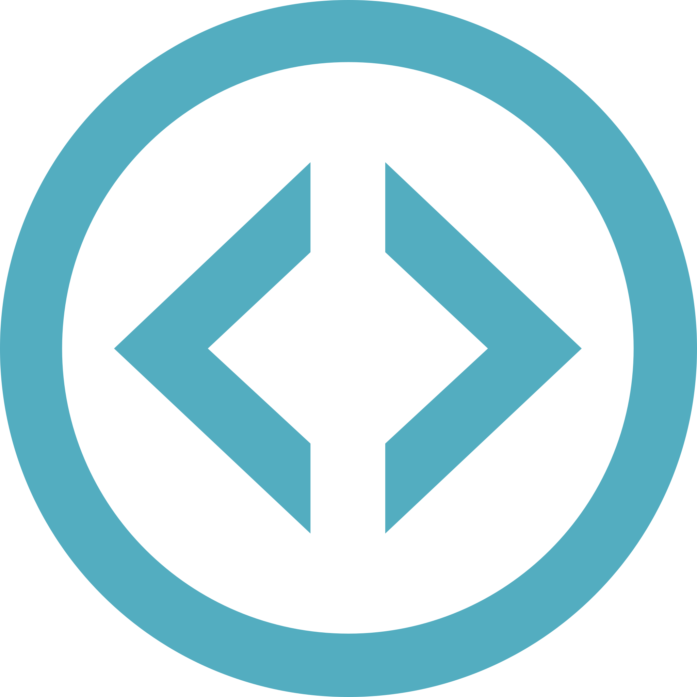

<h1 align="center">
   <br/>
  MLOps-Flask
</h1>

<p align="center">
  

  

  

  

  

  <a href="https://github.com/vcwild/mlops-flask/blob/master/LICENSE.md">
    
  <a>
</p>

<!-- TOC -->
- [APIs](#apis)  
- [How it Works](#how-it-works)  
- [Local Deployment](#local-deployment)  
- [Automations](#automations) 
- [Project Organization](#project-organization)
<!-- /TOC -->

## APIs
### Sentiment Analysis
Machine Learning sentiment analysis API is available at: [https://ml-api.run.app/sentiment/](https://ml-api-qinvsjdm4a-rj.a.run.app/sentiment/)

### House Prices
Regression model API available at: [https://ml-api.run.app/prices/](https://ml-api-qinvsjdm4a-rj.a.run.app/prices/)
- Requires: POST method, Basic Auth
- Header Content-Type: application/json

## How it Works

### Endpoints

#### [GET]

- sentiment/\<sentiment>

#### [POST]

- prices
  - Request
  ```{javascript}
  {
    "size":int,
    "year":int,
    "garage":int
  }
  ```
  - Response
  ```{javascript}
  {
    "price": float
  }
  ```

  **Example implementation**

  - Request
  ```{javascript}
  {
    "size":140,
    "year":2005,
    "garage":1
  }
  ```
  - Response
  ```{javascript}
  {
    "price": 185317.82054
  }
  ```

## Local Deployment

### LINUX Ubuntu/Debian

Install Docker (skip this if you already have Docker installed)

```sh
# get Docker
curl -fsSL https://get.docker.com -o get-docker.sh
# create Docker group
sudo groupadd docker
# add user to the Docker group
sudo usermod -aG docker $USER
```
#### Method 1

Get the default container

```sh
docker run -d -p 5000:5000 vcwild/mlops-run
```
#### Method 2

By using the Miniconda environment

```sh
docker run -d -p 5000:5000 vcwild/conda-run
```

### Windows

- [Install Docker Desktop](https://docs.docker.com/docker-for-windows/install/)
- [Get container](https://hub.docker.com/r/vcwild/mlops-run)

## Automations

Machine learning model deployment on GCP automated with GitHub Actions.
